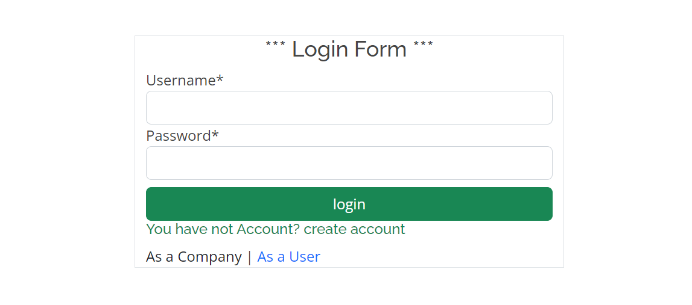
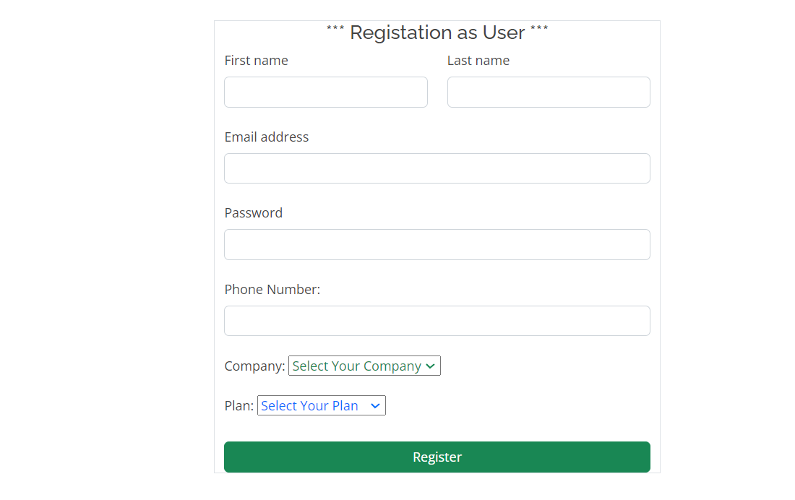

# Project Name: healthos
# Description
Django app to track enterprise customers who pay a monthly subscription for a phone and data plan.

# Features
User registration and login

# login

# Registation User

# Registation Company

# Home 

# Installation
1. Clone the repository: git clone https://github.com/awesomeAPI.git
2. Install dependencies: pip install django, twilio
3. Run migrations: python manage.py makemigrations & python manage.py migrate
4. Create a .env file in the root directory and set the following environment variables:
5. SECRET_KEY: A secret key for Django
6. DEBUG: Debug mode (set to True for development and False for production)
7. DB_NAME: Name of the database
8. DB_USER: Database user
9. DB_PASSWORD: Database password
10. DB_HOST: Database host
11. DB_PORT: Database port

# Usage
1. Start the development server: python manage.py runserver
2. Open http://127.0.0.1:8000/ in your browser to access the API endpoints
3. Use an API client like Postman to send requests to the endpoints

# Sample Requests and Responses
# Register
# Request
- POST http://127.0.0.1:8000/register/
- Content-Type: application/json

{
    "firstname": "firstname",
    "last":"last name"
    "email": "@example.com",
    "password": "password"
    "phone": "01500000000"
    "Company":"Name company or single"
    "Plan":"plan"
    
}
# Response

{
    "message": "User registered successfully"
}
# Login
# Request

-POST http://127.0.0.1:8000/login/
-Content-Type: application/json

{
    "username": "username",
    "password": "password"
}
# Response

{
    "token": "eyJ0eXAiOiJKV1QiLCJhb

<h5>Thank you views my project </h5>
