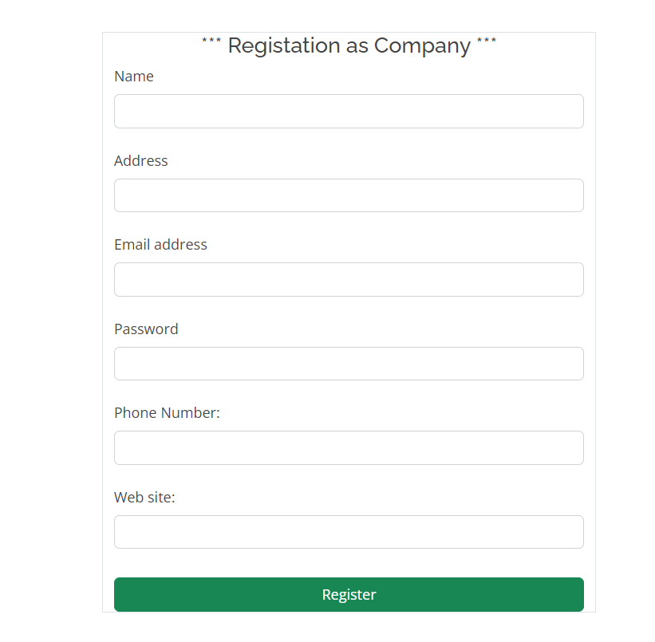

# Project Name: healthos
# Description
Django app to track enterprise customers who pay a monthly subscription for a phone and data plan.

# Features
User registration and login

# login

# Registation User

# Registation Company

# Home 

# Installation
Clone the repository: git clone https://github.com/awesomeAPI.git
Install dependencies: pip install django, twilio
Run migrations: python manage.py makemigrations & python manage.py migrate
Create a .env file in the root directory and set the following environment variables:
SECRET_KEY: A secret key for Django
DEBUG: Debug mode (set to True for development and False for production)
DB_NAME: Name of the database
DB_USER: Database user
DB_PASSWORD: Database password
DB_HOST: Database host
DB_PORT: Database port

# Usage
1. Start the development server: python manage.py runserver
2. Open http://127.0.0.1:8000/ in your browser to access the API endpoints
3. Use an API client like Postman to send requests to the endpoints

<h5>Thank you views my project </h5>
